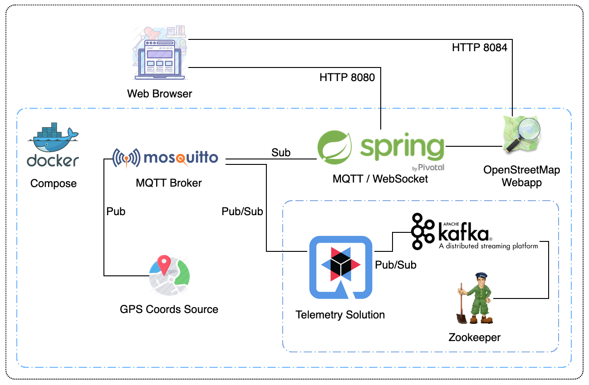
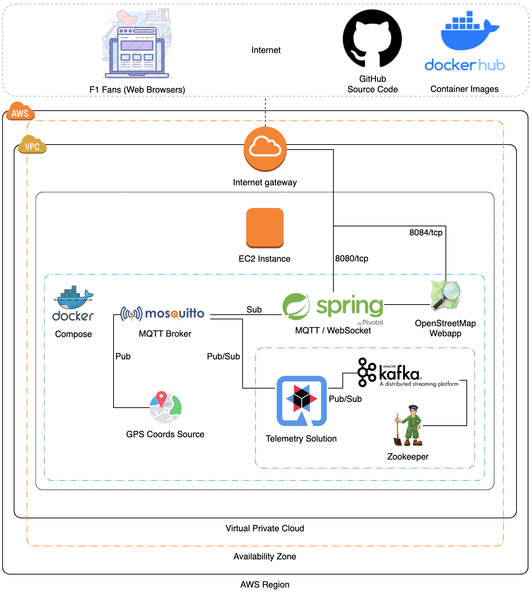
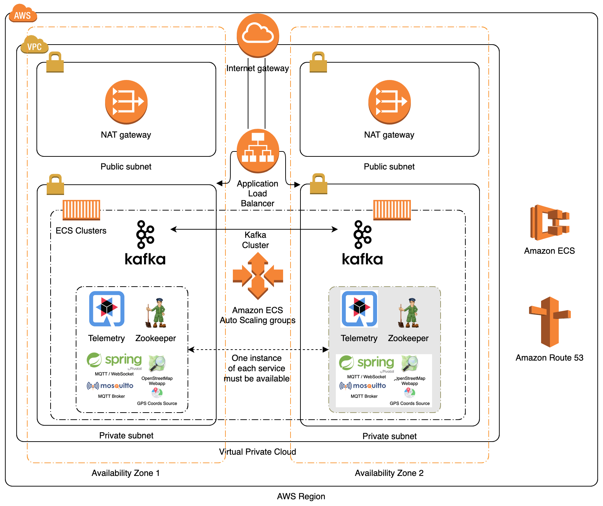

# Solution: MAT Fan Engagement Coding Challenge

## Introduction

The purpose of this challenge is for you to demonstrate
* Document how to run and test your deployment.
* The development of a MQTT client that subscribes to telemetry, receives the data, and stores them in a data store.
* Configuration Management code (e.g. Puppet/Chef/Ansible) and/or Dockerfile(s) or equivalent code that deploys:
  * a suitable storage medium (your data store)
  * the MQTT data archiver you wrote in an appropriate language of your choice
  * any additional service you think is appropriate for such a platform
* A public cloud deployment plan

Feel free to use any libraries, frameworks or dependencies you want in order to achieve the task.

Please include instructions on how to build and run your code, any tests you've written and some text explaining what you did.

If you are already familiar with the underlying technologies we hope that it won't take you more than a couple of hours to get your application up and running.

## Scenario

Real-time data from a Formula 1 race has been recorded and streamed into our system. We want to use that data in order to increase fan engagement by providing a live visualisation.

## Challenge

Raw telemetry data is arriving via MQTT. A basic front-end application has been developed to visualise F1 cars going around a track. It can also display an event stream and car status information such as speed and position, but currently it is not receiving this information.

Please develop a data storage application which subscribes to the provided MQTT broker and consumes data from the following MQTT topic with the format shown and stores them to a meaningful medium.
Additionally please provide on the README file a strategy of deploying this solution to the public cloud provider of your choice.

## Solution Overview



The `Telemetry Solution` for the coding challenge has been implemented in Java and docker-compose, with:
- the [Quarkus](https://quarkus.io/) framework,
- and [Apache Kafka](https://kafka.apache.org/) as the streaming platform and data store.

I haven't used Quarkus before and this coding challenge presented me with a good opportunity to learn a new framework.  Overall, I'm pleased with the results and can recommend Quarkus as an excellent alternative to similar "older" frameworks, considering its first-class support for cloud providers, containerisation technologies and serverless (Lambda) application architectures.

Working from the diagram above, the `Telemetry Solution` provides:
- The [CarCoordinateService](./solution/src/main/java/com/github/nicdesousa/telemetry/service/CarCoordinateService.java) that subscribes to the `carCoordinate` MQTT topic (provided by the `broker` service) and streams the consumed telemetry data to a `carCoordinate` topic in the `kafka` service.  
    - This service also subscribes to the `carCoordinate` topic (provided by the `kafka` service) and asynchronously consumes and processes the `carCoordinate` stream to perform the telemetry data processing.

- The [TelemetryService](solution/src/main/java/com/github/nicdesousa/telemetry/service/TelemetryService.java) that processes the `carCoordinate`'s data stream and:
    - Calculates the total distance that each [Car](./solution/src/main/java/com/github/nicdesousa/telemetry/domain/Car.java) has travelled using the [Haversine](./solution/src/main/java/com/github/nicdesousa/telemetry/util/Haversine.java) formula.
    - Maintains an ordered list of Car's (sorted by total distance travelled) and:
        - Calculates and publishes MQTT [CarStatus](./solution/src/main/java/com/github/nicdesousa/telemetry/domain/CarStatus.java) topic updates (with the [CarStatusService](./solution/src/main/java/com/github/nicdesousa/telemetry/service/CarStatusService.java]) for both the speed and position of each Car.
        - Detects and publishes MQTT [Events](./solution/src/main/java/com/github/nicdesousa/telemetry/domain/Event.java) topic updates (with the [EventsService](./solution/src/main/java/com/github/nicdesousa/telemetry/service/EventsService.java)) for any Car's that have been overtaken.

### Building and running the code locally

**Prerequisites**

* [docker](https://docs.docker.com/)
* [docker-compose](https://docs.docker.com/compose/)

I've provided a bash script to automate the code compilation, testing and execution of docker-compose:

```console
./buildAndRun.sh
```

Open: [http://localhost:8084](http://localhost:8084)

Press `Control+C` to stop docker-compose.

The code includes Unit Tests for the [Haversine](./solution/src/test/java/com/github/nicdesousa/telemetry/util/HaversineTest.java) formula implementation, since this was the most complex part of the implementation that would benefit from dedicated static testing.

The source code can be compiled and tested by running:

```console
cd solution
./build.sh
```

### Deploying and running the code on AWS

1. Login to your AWS Console: [https://aws.amazon.com](https://aws.amazon.com)
2. [Click here](https://eu-west-2.console.aws.amazon.com/ec2/v2/home?region=eu-west-2#LaunchInstanceWizard:) to create a new EC2 instance
4. Follow the onscreen prompts to provision a new EC2 instance with:
    - Image: Amazon Linux 2 AMI (HVM), SSD Volume Type (ami-05f37c3995fffb4fd)
    - Instance Type: t2.medium
    - On the `Instance Details` page, paste the following script into the `User Data` textbox under `Advanced Settings`:
```console
#!/bin/bash
yum update -y
yum install -y docker git
systemctl enable docker --now
curl -L "https://github.com/docker/compose/releases/download/1.25.0/docker-compose-$(uname -s)-$(uname -m)" -o /usr/local/bin/docker-compose
chmod +x /usr/local/bin/docker-compose
usermod -aG docker ec2-user
cd /home/ec2-user
git clone https://github.com/nicdesousa/MAT-Coding-Challenge.git
chown ec2-user:ec2-user -R /home/ec2-user/MAT-Coding-Challenge

```
5. Click `Review and Launch`
6. Click `Edit security groups` and add the following rules with `Add Rule`:

|Type|Protocol|Port Range|Source|Description|
|---|---|---|---|---|
|Custom TCP|TCP|8084|0.0.0.0/0|MAT Fan App HTTP|
|Custom TCP|TCP|8080|0.0.0.0/0|MAT Fan App Websocket|

7. Click `Review and Launch` and then `Launch`
8. [Click here](https://eu-west-2.console.aws.amazon.com/ec2/v2/home?region=eu-west-2#Instances:sort=instanceId) and wait for your new EC2 `Instance State` to show `running`
9. Right-click on your EC2 instance and select: 
    - `Connect`
    - `EC2 Instance Connect (browser-based SSH connection)`
    - Ensure the `User name` is `ec2-user`
    - Click `Connect`
10. Start docker-compose with the following commands:
```console
cd MAT-Coding-Challenge
docker-compose up -d
```
11. Copy the IP Address next to `Public IPs` on the bottom-left of the window.
12. Open a new browser tab/window and paste the copied IP Address, append `:8084` and press enter.

You have now successfully deployed the MAT Coding Challenge Solution to a single EC2 Instance:



13. When you're done, please remember to terminate your EC2 instance:
    - [Click here](https://eu-west-2.console.aws.amazon.com/ec2/v2/home?region=eu-west-2#Instances:sort=instanceId)
    - Right-click on your EC2 instance and select: `Instance State`->`Terminate`

### AWS Production Deployment Architecture

While it is out of scope of this challenge, the diagram below is an example of what a production solutions architecture should look like when applying the best-practices from the (AWS Well-Architected Framework)[https://aws.amazon.com/architecture/well-architected/].


