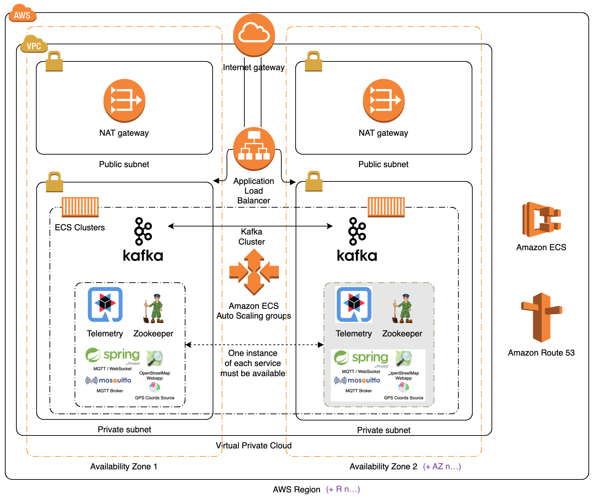

# MAT Fan Engagement Coding Challenge

## Solution Overview


The `Telemetry Solution` for the coding challenge has been implemented in Java and docker-compose, with:
- the [Quarkus](https://quarkus.io/) framework,
- and [Apache Kafka](https://kafka.apache.org/) as the streaming platform and data store.

### Architectural Design Decisions

- Kafka as both the streaming platform and persistent data store (/archive):
    - **Motivation**
    - This may seem counter-intuitive at first. Kindly note, however, that Kafka is a `streaming platform` and not a "traditional" `messaging system` where messages are deleted from queues once they've been successfully consumed.
    - There are three primary differences between Kafka and traditional messaging systems:
        - Kafka stores a persistent log which can be re-read and kept indefinitely.
        - Kafka is built as a modern distributed system: it runs as a cluster, can expand or contract elastically, and replicates data internally for fault-tolerance and high-availability.
        - Kafka is built to allow real-time stream processing, not just processing of a single message at a time. This allows working with data streams at a much higher level of abstraction.
    - **Benefits**
    - Stream processing jobs perform computation(s) from a stream of data coming in via Kafka. When the `logic of the stream processing code changes`, you often want to recompute the results. A very simple method to accomplish this is to reset the topic offset (either to zero or a specific starting time, etc.) so that the application can recompute the results with the new code. (I.e. [The Kappa Architecture](https://www.oreilly.com/radar/questioning-the-lambda-architecture/))
    - We can have an in-memory cache in each instance of the application that is fed by updates from Kafka. A very simple way of building this is to make the Kafka topic log compacted, and have the application simply start fresh at `offset zero` whenever it restarts to populate its cache.
    - Kafka is often used to capture and distribute a stream of "database" updates (this is often called Change Data Capture or CDC). Applications that consume this data in steady state only need the newest changes. New applications, however, need start with a full dump or snapshot of data. Performing a full dump of a large production database is, however, often a very delicate (performance impacts, etc.) and time consuming operation. Enabling log compaction on the topic(s) containing the stream of changes allows consumers of this data to perform simple reloads by resetting to offset to zero.
    - **Implications**
    - Only the CarCoordinate MQTT source data will be published (and persisted) in the `carCoordinate` Kafka topic.
    - Stream processing outputs (i.e. CarStatus and Events MQTT messages) are ephemeral and will **not** be stored in Kafka.
    - This architecture enables the solution to reset the offset for the `carCoordinate` topic to zero (when required) in order to recompute the results (i.e. CarStatus and Events MQTT messages) when code/logic changes need to be implemented.

- Quarkus
    - **Motivation**
    - Quarkus provides all of the required functionality to build the solution.
    - I haven't used Quarkus before and decided that this coding challenge presents me with a good opportunity to learn a new framework.
    - **Benefits**
    - Quarkus is an alternative to similar, but "older" frameworks, and provides excellent development functionalities and supports integration with cloud providers, containerisation technologies and serverless (Lambda) application architectures.
    - Quarkus can compile Java bytecode to native OS binaries with extremely impressive results:
    
    - **Implications**
    - Using Quarkus required me to invest some time to learn a new framework.

### Description of the core services and logic in the solution

Working from the diagram above, the `Telemetry Solution` provides:

- The [CarCoordinateService](./solution/src/main/java/com/github/nicdesousa/telemetry/service/CarCoordinateService.java) that subscribes to the `carCoordinate` MQTT topic (provided by the `broker` service) and streams the consumed telemetry data to a `carCoordinate` topic in the `kafka` service.  
    - This service also subscribes to the `carCoordinate` topic (provided by the `kafka` service) and asynchronously consumes and processes the `carCoordinate` stream to perform the telemetry data processing.

- The [TelemetryService](./solution/src/main/java/com/github/nicdesousa/telemetry/service/TelemetryService.java) that processes the `carCoordinate`'s data stream and:
    - Calculates the total distance that each [Car](./solution/src/main/java/com/github/nicdesousa/telemetry/domain/Car.java) has travelled using the [Haversine](./solution/src/main/java/com/github/nicdesousa/telemetry/util/Haversine.java) formula.
    - Maintains an ordered list of Car's (sorted by total distance travelled) and:
        - Calculates and publishes MQTT [CarStatus](./solution/src/main/java/com/github/nicdesousa/telemetry/domain/CarStatus.java) topic updates (with the [CarStatusService](./solution/src/main/java/com/github/nicdesousa/telemetry/service/CarStatusService.java)) for both the speed and position of each Car.
        - Detects and publishes MQTT [Events](./solution/src/main/java/com/github/nicdesousa/telemetry/domain/Event.java) topic updates (with the [EventsService](./solution/src/main/java/com/github/nicdesousa/telemetry/service/EventsService.java)) for any Car's that have been overtaken.

### Building and running the code locally

**Prerequisites**

* [docker](https://docs.docker.com/)
* [docker-compose](https://docs.docker.com/compose/)

A bash script has been provided to automate the code compilation, testing and execution of docker-compose:

```console
./buildAndRun.sh
```

Open: <a href="http://localhost:8084" target="_blank">http://localhost:8084</a>

Press `Control+C` to stop docker-compose.

The code includes Unit Tests for the [Haversine](./solution/src/test/java/com/github/nicdesousa/telemetry/util/HaversineTest.java) formula implementation, since this was the most complex part of the implementation that would benefit from dedicated static testing.

The source code can be compiled and tested by running:

```console
cd solution
./build.sh
```

### Deploying and running the code on AWS

> Note: I would normally automate the provisioning and deployment, but doing so (in this case) will require exposing **your** credentials and access to AWS services/resources to potentially dodgy code/scripting/etc. that has been provided by a third-party. I will **not** run untrusted provisioning/deployment code, and naturally I wouldn't expect you to do this.

1. Login to your AWS Console: <a href="https://aws.amazon.com" target="_blank">https://aws.amazon.com</a>
2. <a href="https://eu-west-2.console.aws.amazon.com/ec2/v2/home?region=eu-west-2#LaunchInstanceWizard:" target="_blank">Click here</a> to create a new EC2 instance
4. Follow the onscreen prompts to provision a new EC2 instance with:
    - Image: Amazon Linux 2 AMI (HVM), SSD Volume Type (ami-05f37c3995fffb4fd)
    - Instance Type: t2.micro
    - On the `Instance Details` page, paste the following script into the `User Data` textbox under `Advanced Settings`:
```console
#!/bin/bash
# update the system and install required packages
yum update -y
yum install -y docker git
# start docker on boot
systemctl enable docker --now
# install docker-compose
curl -L "https://github.com/docker/compose/releases/download/1.25.0/docker-compose-$(uname -s)-$(uname -m)" -o /usr/local/bin/docker-compose
chmod +x /usr/local/bin/docker-compose
usermod -aG docker ec2-user
# clone the solution's git repo
cd /home/ec2-user
git clone https://github.com/nicdesousa/MAT-Coding-Challenge.git
chown ec2-user:ec2-user -R /home/ec2-user/MAT-Coding-Challenge
# allocate some swap (file) memory to enable the solution to run on a t2.micro instance
# note: doing this is only suitable for a very small demo and certainly not recommended for anything else...
fallocate -l 1G /swapfile
chmod 600 /swapfile
mkswap /swapfile
swapon /swapfile
echo "/swapfile none swap sw 0 0" >> /etc/fstab
# run docker-compose when the instance boots
echo "runuser -l ec2-user -c 'cd /home/ec2-user/MAT-Coding-Challenge/; docker-compose up -d'" >> /etc/rc.local
chmod +x /etc/rc.d/rc.local
# "reboot" to apply the instance changes
reboot
```
5. Click `Review and Launch`
6. Click `Edit security groups` and add the following rules with `Add Rule`:

|Type|Protocol|Port Range|Source|Description|
|---|---|---|---|---|
|HTTP|TCP|80|0.0.0.0/0|MAT Fan App HTTP|
|HTTPS|TCP|443|0.0.0.0/0|MAT Fan App Websocket|

>Note: The solution enables using ports 80 and 443 instead of 8084 and 8080 to allow access for clients behind a restrictive (network or corporate) proxy server.

7. Click `Review and Launch` and then `Launch`
8. Click `View Instances` and wait ±5 minutes for the provisioning and deployment to complete.
9. Select your new EC2 instance, and copy the IP Address next to the `Description panel's`->`IPv4 Public IP` field.
10. Open a new browser tab/window, paste the copied IP Address, and press enter. (Please refresh the page until the site contents is shown.)

The Solution to the MAT Coding Challenge has now been deployed to a single EC2 Instance:


11. When you're done, please remember to terminate your EC2 instance:
    - <a href="https://eu-west-2.console.aws.amazon.com/ec2/v2/home?region=eu-west-2#Instances:sort=instanceId" target="_blank">Click here</a> to view your AWS EC2 instances
    - Right-click on your EC2 instance and select: `Instance State`->`Terminate`

### AWS Production Deployment Architecture

While it is out of scope for this challenge, the diagram below is an example of what a production solutions architecture could look like when applying the best-practices from the [AWS Well-Architected Framework](https://aws.amazon.com/architecture/well-architected/).

In this case, we use the existing containerised services (i.e. no code changes) and leverage ECS clusters with auto-scaling groups to provide a low-maintenance, secure, reliable, performant, and cost-effective AWS-based solution.



## The Final Product: MAT Coding Challenge Dashboard


### EC2 (t2.micro) Instance Metrics


Very impressive results, considering the workload that is running on this t2.micro instance!