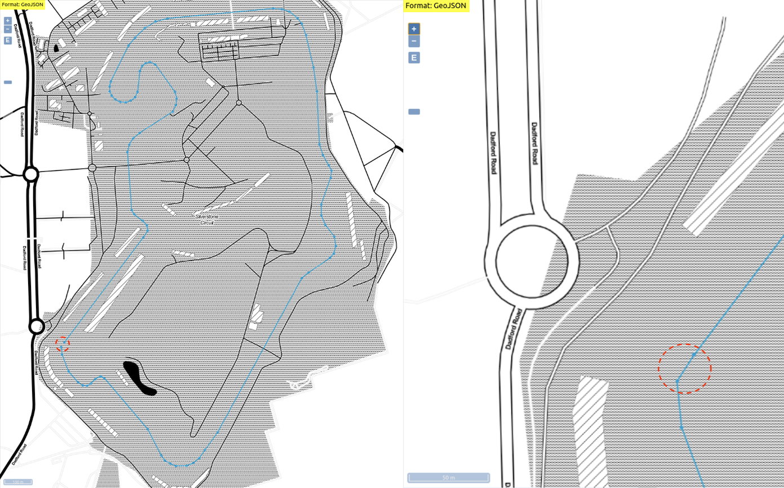

# GeoJSON Distance Calculation

## Overview

The `GPS Source` service uses a GeoJSON file with `LineString` coordinates to represent a lap around the Silverstone Circuit.

The source data (`silverstone.json`) results in a circuit length of `~5.09963 km`, while the lap distance calculation of Car's in the `Telemetry Solution` (i.e. `silverstone_closed.json`) is `~5.11977 km`. 

This is because the Haversine distance calculation uses two Location updates that, in this case, closes the polygon:



```console
./nodejs calcDistance.js
Silverstone.json        distance: 5099.633744757203
Silverstone_closed.json distance: 5119.771376975698
```

The current circuit length for [Silverstone](https://live.planetf1.com/british-grand-prix/silverstone-circuit/10/41146/circuit-info) is `5.901 km`.

Using the current circuit length would result in an incorrect finishing line being used for updates/events that are shown in the Webapp.

For this reason the Telemetry Solution uses `~5.11977 km` as the circuit length to try and keep everything synchronized.
